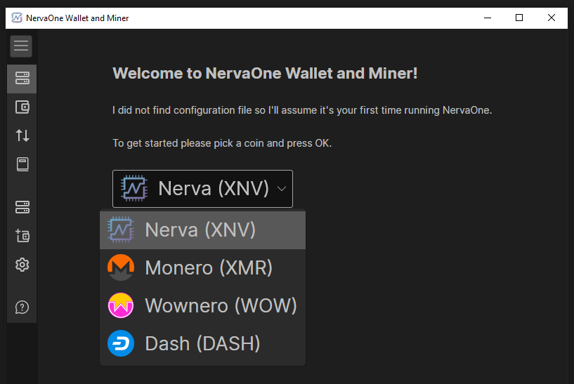

# NervaOne Guide
NervaOne is a new, modern GUI application. It's a multi-coin, open source wallet and CPU miner that currently supports Nerva, Monero, Wownero and Dash. More coins will be added in the future. This is non-custodial wallet so you are running client tools on your own device.

## NervaOne Videos

@evanation81 created a few videos about NervaOne. You can view them below:

[How to set up NervaOne, mine XNV, create wallet, save seed phrase, open wallet, view transactions][evanation-01].

[Mining Nerva using multiple nodes on the same network][evanation-02].

## Screenshots

Daemon view is where you see connections and control mining:

## Downloading

Binary distributions can be found [here][nerva-downloads-link].

Select the appropriate file for the target platform (Windows, Linux or macOS).

## Installing

There is nothing to install. You just download the zip file, extract it and run the application!

## Starting up NervaOne Desktop for the first time

First time you run NervaOne, it will ask you to select coin. Select Nerva (XNV) and press OK:

It will give up option to change client tools download link and once you confirm, it will download, extract and start nervad

## Creating a Wallet / Restoring a Wallet

To create new wallet, go to: Wallet Setup > Create New Wallet

To restore existing wallet from keys or seed go to: Wallet Setup > Restore Wallet from Seed or Restore Wallet from Keys

## Opening a Wallet

Go to: Wallet > Open Wallet. A dialog will pop up and it will display available wallets.

## Exporting Keys

Each NERVA wallet is, essentially, just a string of 25 words from which the public address is derived.

It is **very** important to export these keys and back them up somewhere that is safe and secure (meaning somewhere reliable/permanent that no one else can access).

In the event of a lost or corrupted wallet file, computer crash, etc., the 25 word mnemonic seed and Private Spend Key are the **only way** to restore a wallet and recover the funds it holds.

**DO NOT SHARE IT WITH ANYONE**. **Anyone who has these can *access your funds* and has *complete control* over your wallet.**

In NervaOne Desktop, go to Wallet Setup > View Keys and Mnemonic Seed

Wallet public and private keys as well as 25  word mnemonic seed will be displayed.

**safely save and store these words and keys**

## Transferring funds

Go to: Wallet > Transfer Funds, provide required fields and press OK

*If a payment id is provided, you **must** give it, otherwise you risk losing your funds!*

Enter your password if asked and press OK.

Your transaction should now be on the way to the recipient's wallet!

## Moving Wallet to Another Device

If you'd like to move your wallet to another device, you can just copy wallet files.

Go to: Wallet Setup and click "Open Wallets Folder". Copy the wallet that you want to move and paste it to the same folder on another device.

Make sure you copy both .cache and .keys files or your wallet might not open properly.

## Exiting the Wallet

To exit NervaOne, simply click X on the top.

## libhidapi library missing in macOS
If your nervad does not start on macOS because you get error similar to this:

dyld(9313): Library not loaded: '/usr/local/opt/hidapi/lib/libhidapi.0.dylib'
Refrenced from: '....nervad'
Reason: tried '....libhidapi.0.dylib' (no such file)

Try fix from [here][macos-library-error].

Those should be the commands that you need to run:

`brew update`

`brew reinstall hidapi`

If you do not have homebrew, you'll need to install it from [here][homebrew].

## How to set up NervaOne on a computer that does not support AES

* When first starting NervaOne and after you select Nerva (XNV), change default client tools download link to non-minimal version: https://github.com/nerva-project/nerva/releases/download/v0.1.8.0/nerva-v0.1.8.0_windows.zip
* Go to Daemon Setup and click "Open Client Toosl Folder"
* Exit NervaOne and kill nervad in task manager if it's running
* In that cli folder, rename nervad.exe to something else and after that rename nervad-noaes.exe to nervad.exe
* Start NervaOne

NervaOne should now use non-aes version of nervad and you should be able to mine.

NOTE: You will not be able to create/open wallet in non-aes version

<!--Reference links -->
[nerva-downloads-link]: https://nerva.one/#downloads
[macos-library-error]: https://dede.dev/posts/Fixing-Library-not-loaded-Error-on-macOS/
[homebrew]: https://brew.sh/
[evanation-01]: https://www.youtube.com/watch?v=poLrP65jsf4&t=325s
[evanation-02]: https://www.youtube.com/watch?v=BYsSI5mAwCU